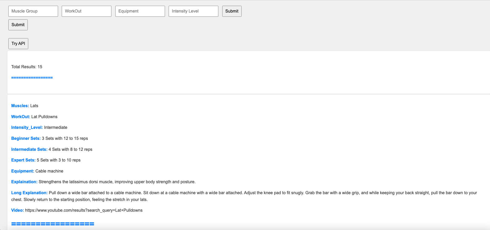

# Work-Out-APP

## Introduction
Work-Out-APP is a web application designed for fitness enthusiasts and professionals. It utilizes the [Work Out API](https://rapidapi.com/naeimsalib/api/work-out-api1) to accept specific parameters, send requests to the API, and retrieve all workout routines matching these parameters. The app offers a user-friendly interface for exploring a wide range of exercises, including detailed descriptions, instructional content, and video demonstrations.

## Features
- Search for workouts based on muscle groups, workout names, equipment, and intensity levels.
- View detailed exercise descriptions, benefits, and video tutorials.
- Customizable workout plans based on user preferences and available equipment.

## Getting Started
These instructions will get you a copy of the project up and running on your local machine for development and testing purposes.

### Prerequisites
- Python 3.6 or higher
- Flask
- Requests library
- Access to the Work Out API on RapidAPI

### Installation
1. Clone the repository:
   ```bash
   git clone https://github.com/[your-github-username]/Work-Out-APP.git

1. Navigate to the project directory:
   ```bash
   cd Work-Out-APP
3. Install required Python packages:
   ```bash
   pip install -r requirements.txt

Running the Application
1. Start the Flask application:
   ```bash
   python app.py
3. Open your web browser and navigate to:
   ```bash
   http://127.0.0.1:5000/
5. Interact with the application's UI to send requests to the Work Out API and view the results.

   Testing with [Work Out API](https://rapidapi.com/naeimsalib/api/work-out-api1)
To test the application with the [Work Out API](https://rapidapi.com/naeimsalib/api/work-out-api1):

Sign up or log in to RapidAPI and subscribe to the Work Out API.
Obtain your API key from RapidAPI.
Insert your API key into the application's code where API requests are made.
Follow the "Running the Application" steps above to test the API integration.
Contributing
Please read CONTRIBUTING.md for details on our code of conduct, and the process for submitting pull requests to us.

# Demonstration of the Web app to test out the Work Out API

## Main Web APP Page


## Doing a search for all Lats workouts


## Doing a search for all chest workouts that also has Expert Intensity Level


